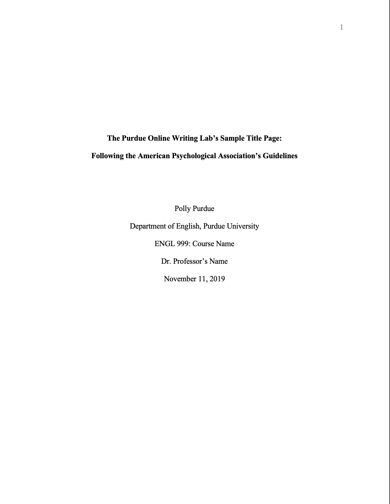
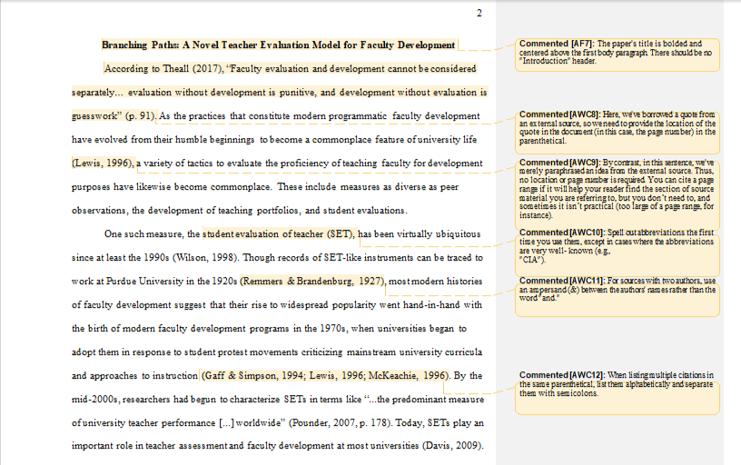
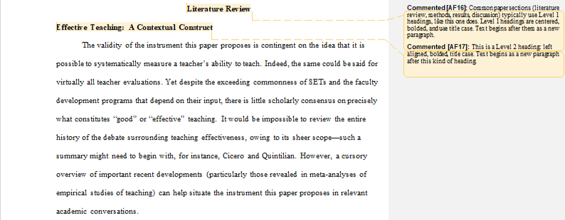
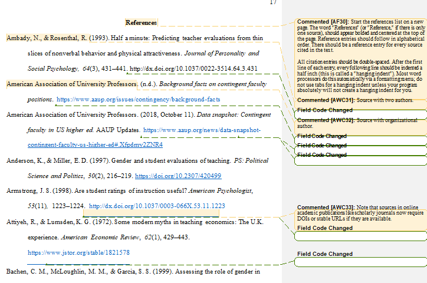

- All text should be double-spaced
- 1 inch margins
- page header at top of each page
- page numbers flush right
- tittle of paper flush left
	- ==also called the running head shouldn't pass 50 characters including spacing and punctuation==
- Fonts:
	- 11 point calibri, arial georgia
	- 10 point lucida sans, computer modern
	- 12 point times new roman
- Sections
	- Title Page: Title in upper and lowercase in the upper half of the page, centered, in boldface; no abbreviations or pointless words, one or two lines
		- author's name: first name , middle initials and last name  ,do not use titles
		- institutional affliation should be below the author's name
		- ==Students paper should have: course number and name, instructor name assignment due date==
		- Student example
		- {:height 545, :width 416}
	- Professional: authors note should be beneath the institutional affiliation, not need in a paper
	- https://owl.purdue.edu/owl/research_and_citation/apa_style/apa_formatting_and_style_guide/images/20200127APAProfTitlePage.png{:height 512, :width 416}
		-
	- Abstract: centered bold, do not ident paragraphs
		- ==**may not required for student papers**==
		- on the next line write a summary on the key points of the research,
		- ==**This should not be more than 250 words, a single paragraph double spaced.**==
		- should contain research topics, research questions, participants, methods, results, data analysis and conclusions
		- {:height 936, :width 718}
		- https://owl.purdue.edu/owl/research_and_citation/apa_style/apa_formatting_and_style_guide/images/20200127APAAbstract.png
		-
	- Main Body
	- {:height 477, :width 748}
	- 
	-
	- References: Should be done in alphabetical order
	- (Smith, 2020, p. 170).
	- All lines after the first line of each entry in your reference list 
	  should be indented one-half inch from the left margin. This is called 
	  hanging indentation.
	- All authors' names should be inverted (i.e., last names should be provided first).
	- Authors' first and middle names should be written as initials.
	- For example, the reference entry for a source written by Jane Marie Smith would begin with "Smith, J. M."
	- If a middle name isn't available, just initialize the author's first name: "Smith, J."
	- 